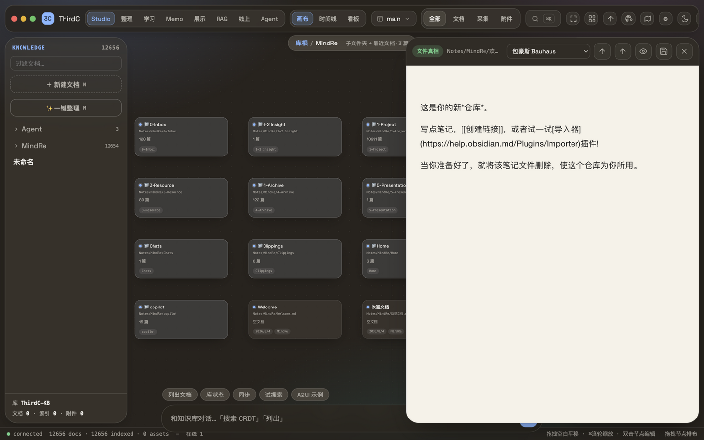
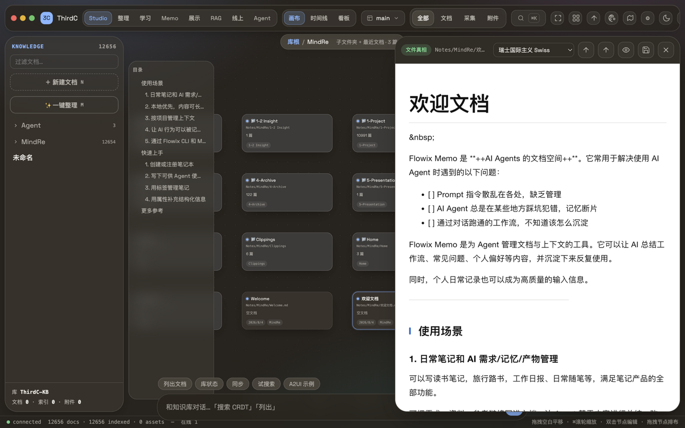
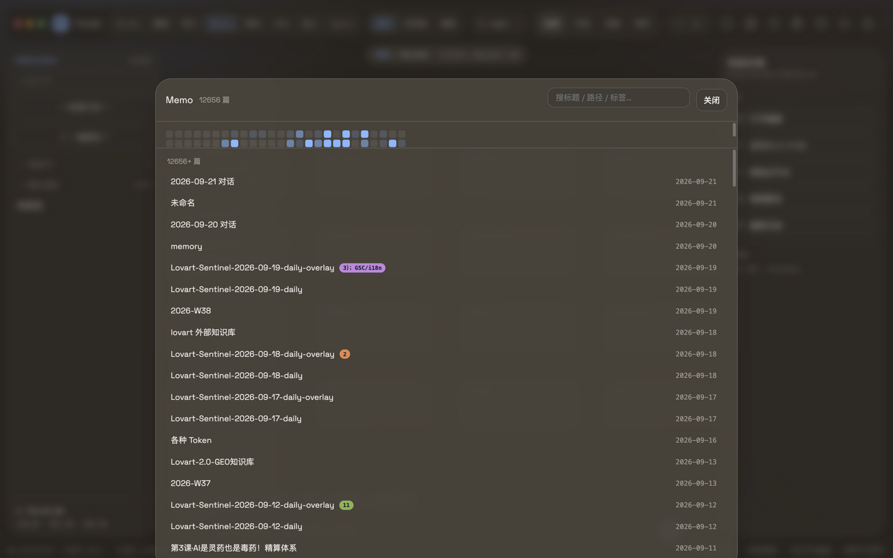

<div align="center">

# ThirdC Studio

**AI Native 知识工作台 — 你的知识库是文件，也是画布，也是 agent 的工具。**

[](https://github.com/sevenaaaaaaaaa/thirdc/releases)
[](LICENSE)
[](#-快速开始)
[](https://www.rust-lang.org)
[](docs/spec/PRODUCT.md)

**本地优先 · 开源（AGPL-3.0）· 无锁定** — 数据永远是你磁盘上的 Markdown / HTML / 附件，任何编辑器都能打开。

[下载桌面客户端](https://github.com/sevenaaaaaaaaa/thirdc/releases) · [快速开始](#-快速开始) · [设计规范](docs/spec/)



*画布空间 · 阅读抽屉（50 款设计史经典风格实时换肤）· 七模式一键切换*

</div>

---

## 为什么是 ThirdC

笔记软件把知识锁进私有格式，agent 框架把知识锁进向量库。ThirdC 反过来：**知识库是磁盘上一堆普通的 Markdown**，人用画布和阅读器看它，agent 用同一套本地 API 读写它——双方共享一个真相，谁也不锁定谁。

| | 人 | Agent |
|---|---|---|
| **读** | 画布 / 时间线 / 看板 / Memo 热力图 | `/doc` `/search` MCP 双向 |
| **写** | 所见即所得编辑器 | 同一套 API，写完即索引 |
| **发布** | AI-HTML 静态站 · 加密分享 | llms.txt · Webhook |

## ✨ 特性

- **文件真相** — `Notes/` 下真 Markdown / HTML + CRDT op-log 合并；sidecar（索引/日志）随时删除重建
- **七模式** — Studio 画布 · 整理 · 学习 · **Memo**（写作热力图 + 标签快查）· 展示 · RAG · 线上 · Agent
- **50 款设计风格** — 包豪斯 / 瑞士 / 孟菲斯 / 蒸汽波 / 水墨 / 浮世绘…学习与展示视图一键换肤
- **AI 双向** — MCP server + 流式对话 + 命令模式（无 API key 离线可用）；对话实时显示工具调用与 token 计量
- **采集** — 主题一键建库（Wikipedia / HN / arXiv）· 网页本地化 · PDF/DOCX 解析 · Obsidian 导入 · 浏览器扩展
- **发布** — AI-HTML 静态站（语义标签 + JSON-LD + llms.txt）→ 本地 / Git / S3(R2·OSS·COS) / WebDAV
- **合规** — ICP 注入 · 敏感词 · 机审 API · 审计留痕 · E2EE 加密分享
- **快** — 1.2 万篇文档打开 **7ms**，全文检索 **23ms**；启动预热 + 文件监听式增量同步（见[性能契约](docs/PERF.md)）

<p>
  
  
</p>

*左：Memo 模式（近 180 天写作热力图，点格子看当天）。右：对话优先的 Agent 模式。*

## 🚀 快速开始

### 桌面客户端（推荐）

从 [Releases](https://github.com/sevenaaaaaaaaa/thirdc/releases) 下载 `ThirdC Studio_x.x.x_aarch64.dmg`（Apple Silicon，macOS 12+）。
未做公证，首次打开：**右键 → 打开**，或 `xattr -cr "/Applications/ThirdC Studio.app"`。

默认库 `~/Documents/ThirdC`，首次启动自动创建；应用内库选择器可切换，`THIRDC_VAULT` 环境变量亦可。

### CLI + Web

```bash
cargo build --release -p thirdc
./target/release/thirdc init ./kb MyKnowledge
./target/release/thirdc serve ./kb --addr 127.0.0.1:7700
```

打开 `http://127.0.0.1:7700` → 登录（`admin` / token，见 `kb/.thirdc/machine.toml`；可在 `thirdc.toml` 的 `[auth]` 自定义）。

### 服务端部署

```bash
./deploy/deploy.sh        # rsync → 服务器端构建 → systemd 托管 + Apache 反代
```

启动预热自动完成索引 / 检索语料 / Memo 索引三步（构建在锁外，部署窗口站点照常服务）。

### 从其它知识库迁移

Obsidian 库直接导入（设置面板 → 导入）；PDF / DOCX / 网页 / Wikipedia 主题一键采集。

## 🧭 七模式

| 模式 | 干什么 | 快捷键 |
|---|---|---|
| **Studio** | 画布空间：节点拖排、景深、连线、多画布 | `3` |
| **整理** | 圈选批量：移动 / 打标签 / 删除 | — |
| **学习** | 沉浸阅读 + 50 风格换肤 | — |
| **Memo** | 写作热力图 · 日期/标签快查 · 语音速记 | — |
| **展示** | 文档即幻灯片（同样支持 50 风格） | — |
| **RAG** | 全库检索：FTS5 + TF-IDF 混合排序 | ⌘K |
| **线上** | 发布为静态站 + 分享 | — |
| **Agent** | 对话优先，工具调用全程可见 | ⌘⇧M |

## 🏗 架构

```
采集 → Item → 管道（frontmatter + 块模型 + CRDT op-log + FTS5/TF-IDF + 设计规范）
  ↕                    真相区：Notes/ · Assets/ · thirdc.toml
出口 → AI-HTML 发布 · MCP server · Webhook · 加密分享
```

```
kernel/crates/   kernel-md(块模型+AI-HTML) · kernel-store(CAS+SQLite)
                 kernel-sync(Automerge) · kernel-design · kernel-browser · kernel-a2ui · kernel-deploy
server/          axum daemon（token 鉴权 · ws · SSE）
cli/             thirdc 命令行          desktop/  Tauri 桌面壳（内核内嵌）
mcp/             MCP server (stdio)     extension/ 浏览器扩展（Chrome/Firefox/Safari）
```

桌面端不是浏览器套壳：[桌面独占能力规划](docs/spec/desktop.md)（全盘导入、AI 原生转码、来源去重、本地模型）与[多端路线](docs/spec/platform.md)（一套内核 + 一套前端 + 一张能力表）见规范文档。

## 📐 设计系统与性能契约

继承 [OpenFlow](https://github.com/sevenaaaaaaaaa/openflow) 设计契约：全 oklch · 零 hex · 弹簧缓动 · 玻璃拟态 · 圆角三档。
性能与体验的平衡写成了一份[性能契约](docs/PERF.md)：8 条端点延迟预算 + 门禁脚本，超支即红。

## 🗺 路线图

- [x] 七模式 · Memo 热力图 · 50 设计风格 · 桌面壳
- [x] 启动预热 · 监听式同步 · 性能门禁
- [ ] 桌面独占：全盘索引 · 本地小模型 · 内嵌终端（[规划](docs/spec/desktop.md)）
- [ ] 多端：Windows / Linux / Android / iOS（[规划](docs/spec/platform.md)）
- [ ] 发布目标：GitHub Pages · 对象存储直传

## 许可

AGPL-3.0 — 商用与私有部署欢迎，二次开发请遵守同源许可。

<div align="center">
<sub>芭乐派产品矩阵成员 · 与 <a href="https://github.com/sevenaaaaaaaaa/openflow">OpenFlow</a> 同源的设计契约</sub>
</div>
