<div align="center">

# ThirdC Studio

**AI 时代的知识操作系统——浏览器、MCP、CLI、远端 AI 与本地小模型，共享同一份文件真相。**

不是又一个笔记软件：ThirdC 按**操作系统**的思路生长——内核（Rust crates）管存储与索引，`thirdc serve` 是守护进程，五模式 UI 是它的桌面，HTTP API + MCP 是系统调用 ABI，插件生态是它的 App 世界。0 门槛、自然组织的知识库，是它最先做好的那件事。

不做 Obsidian、Notion 的替代品——它们为你组织知识，ThirdC 让知识自己长成样子：**人随手记、AI 帮你建，一切落在磁盘上一堆普通的 Markdown 上，人和 agent 共享同一个真相。**

[](https://github.com/sevenaaaaaaaaa/thirdc/releases)
[](LICENSE)
[](#-快速开始)
[](https://www.rust-lang.org)
[](docs/spec/PRODUCT.md)

**本地优先 · 核心永久开源（AGPL-3.0）· 无锁定** — 数据永远是你磁盘上的 Markdown / HTML / 附件，任何编辑器都能打开，任何 agent 都能读写。

[下载桌面客户端](https://github.com/sevenaaaaaaaaa/thirdc/releases) · [快速开始](#-快速开始) · [设计规范](docs/spec/) · [超详细功能附录](#附录超详细功能清单每图必讲)

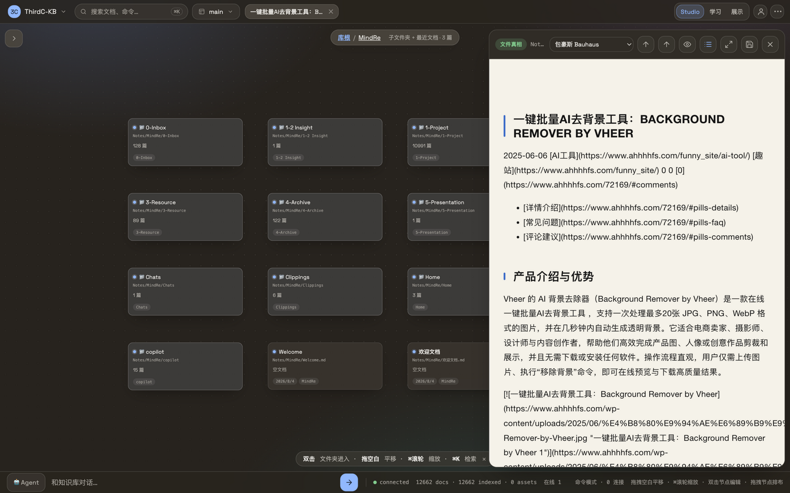

*Flow 画布（PARA 结构自动成图）· Feynman 阅读抽屉（50 款设计史经典风格实时换肤）· 一切皆普通文件*

</div>

---

## 这是什么

AI Agent 时代，知识库有两个失灵的旧答案：

- **笔记软件**（Obsidian / Notion）：功能强大，但门槛高——你得先学会它的方法论，再花几百个小时手工搭建；
- **Agent 框架**（各类 RAG 方案）：把知识锁进向量库和私有格式，人反而看不见、改不了自己的知识。

ThirdC 反过来：**知识库是磁盘上一堆普通的 Markdown**，人用画布和阅读器看它，agent 用同一套本地 API 读写它——双方共享一个真相，谁也不锁定谁。0 门槛体现在：打开就能用，说一句话就能建库，知识自然组织（文件夹即结构、画布即视图），不需要先学一套方法论。

这套「知识操作系统」的分层与纪律——哪些接口是稳定 ABI、能力如何分级、插件如何准入、凭据如何对待——写在[设计宪法](docs/spec/os.md)里，新功能按宪法评审。

| | 人 | Agent |
|---|---|---|
| **读** | Flow 画布 / 时间线 / 看板 / Memo 热力图 | `/doc` `/search` MCP 双向 |
| **写** | 所见即所得编辑器 + 随手记 | 同一套 API，写完即索引 |
| **积累** | 浏览器插件 · 主题一键采集 | 网页本地化 · 连接器拉取 |
| **表达** | Feynman 阅读 / 展示 · 50 款风格 | AI-HTML 静态站 · llms.txt |

## ✨ 核心体验：五模式 all in one

模式是**同一套数据、同一套内核的不同界面配置**——不是五个并列的 App，切换零成本。

| 模式 | 一句话 | 面向 | 入口 |
|---|---|---|---|
| **Flow** | 自由画布：节点拖排、景深、连线、多画布、时间线、看板 | 个人传统知识管理，纯手动，无 AI | 底栏 `✦ Magic`（默认） |
| **Feynman** | 学习-展示：沉浸研读 + 文档即幻灯片，学习成果直接上台 | 输出与分享 | 底栏 `✦ Magic` → `学习` / `展示` |
| **Memo** | 随手记一笔：写作热力图、标签快查、语音速记 | 个人碎片记录 | 侧栏 `📒 Memo` / `⌘⇧M` |
| **Agent-L** | 面向 AI 的 SAG 知识库：对话优先、工具调用全程可见、Agent 记忆 | 你和你的 agents | 底栏 `🤖 Agent` / `⌘K` |
| **Studio** | 工作室：发布、分享、分发，面向内外部生态与商业场景 | 内容运营 / 团队协作 | `⋯` → `⬆ 发布 / 线上` |

<p>
  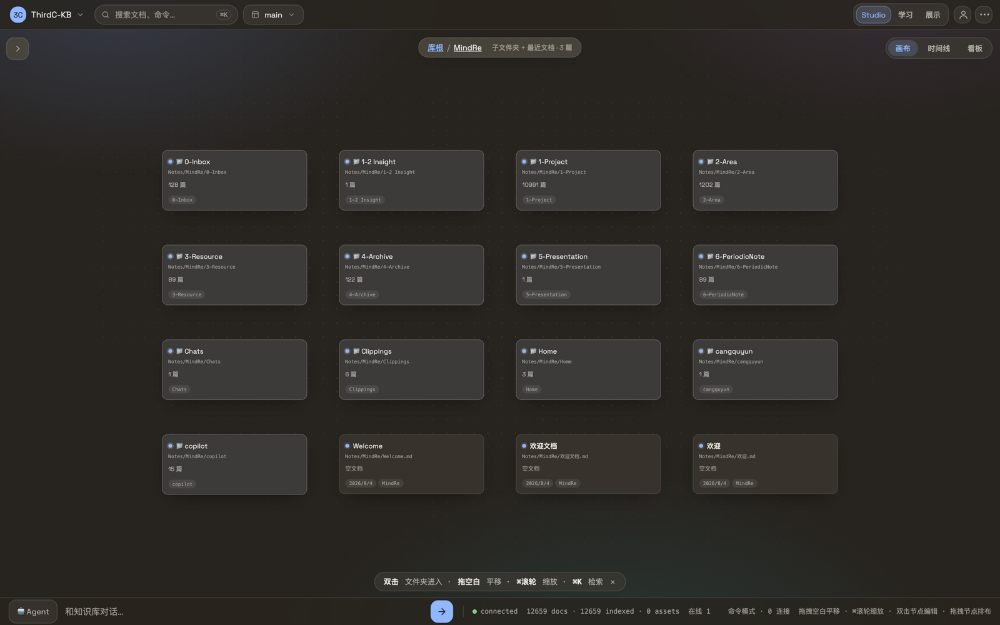
  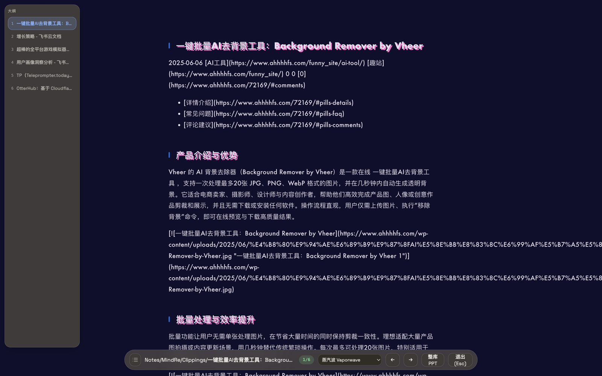
</p>

*左：Flow 自由画布（MindRe 库的 PARA 结构）。右：Feynman 展示模式（蒸汽波风格 + 大纲缩略图）。*

## 🔁 双向 AI

**输入侧——把积累的门槛降到零：**

- **一键建库**：输入一个主题，自动从 Wikipedia / Hacker News / arXiv 采集成库（引导卡第一步就是它）
- **零星积累**：Memo 入口随手记（支持语音转文字）+ 浏览器插件整页 / 选区采集（桌面端离线直采）
- **万物入袋**：网页本地化、PDF / DOCX 解析、Obsidian 库直接导入、MCP 连接器拉取外部系统

**输出侧——让知识随时能上台：**

- **一键整理**：圈选批量移动 / 打标签，或让 AI 按语义聚类搬移
- **快速成稿**：划选即指令（总结 / 精简 / 提取为节点 / 改写 / 扩写 / 翻译）
- **快速成 PPT**：展示模式 50 款预设风格一键换装，`整库 PPT` 一键生成全库幻灯
- **生态体验**：通过 MCP 连接器接入 OpenFlow（图表）、Conflow / WebsFlow / PayFlow / InFlow 等矩阵产品（规划中，见[路线图](#-路线图)）

> AI 对话**无 API key 也能用**：内置命令模式（离线规则引擎，工具调用照常可见）；在 `thirdc.toml` 的 `[ai]` 配置任意 OpenAI 兼容模型后，解锁改写 / 扩写 / 翻译等 AI 动词与 token 计量。

## 📖 开源开放

- **核心功能永久开源**（AGPL-3.0）：画布、编辑器、检索、发布、MCP，全部在这仓库里
- **生态开放**：矩阵产品（OpenFlow / Conflow / WebsFlow / PayFlow / InFlow）与第三方工具统一经 **MCP 连接器**接入，ThirdC 也可作为 MCP server 被其他 agent 调用（`thirdc mcp`）
- **插件友好**：浏览器扩展（Chrome / Firefox / Safari）源码在库；文件真相 = Open Knowledge Format（Markdown 语义 + YAML 元数据 + 块锚点 + JSON-LD），开发者可按[规范](docs/spec/modes-and-roadmap.md)直接读写

## 快速上手

### 桌面客户端(推荐)

从 [Releases](https://github.com/sevenaaaaaaaaa/thirdc/releases) 下载 `ThirdC Studio_x.x.x_aarch64.dmg`(Apple Silicon,macOS 12+)。
未做公证,首次打开:**右键 → 打开**,或 `xattr -cr "/Applications/ThirdC Studio.app"`。

默认库 `~/Documents/ThirdC`，首次启动自动创建；应用内库选择器可切换，`THIRDC_VAULT` 环境变量亦可。Windows（msi/nsis）与 Linux（deb/AppImage）由 CI 构建见 Releases，Android / iOS 客户端初版已可自[源码](desktop/)构建。

### CLI + Web

```bash
cargo build --release -p thirdc
./target/release/thirdc init ./kb MyKnowledge
./target/release/thirdc serve ./kb --addr 127.0.0.1:7700
```

打开 `http://127.0.0.1:7700` → 登录(`admin` / token,见 `kb/.thirdc/machine.toml`;可在 `thirdc.toml` 的 `[auth]` 自定义)。

### 服务端部署

```bash
./deploy/deploy.sh        # rsync → 服务器端构建 → systemd 托管 + Apache 反代
```

启动预热自动完成索引 / 检索语料 / Memo 索引三步(构建在锁外,部署窗口站点照常服务)。

### 从其它知识库迁移

Obsidian 库直接导入(设置面板 → 导入);PDF / DOCX / 网页 / Wikipedia 主题一键采集。

## 🏗 架构

ThirdC 属于芭乐派产品矩阵的**第三层:Studio 套件**——偏本地工具的产品层。矩阵的分层是:

- **OpenFlow = 入口层**:TIPS all-in-one,让一人团队(OPC)与中小团队低门槛完成数字化 + AI 化。
- **Flow 家族 = 进阶层**:MFlow / inFlow / UserLoop / PayFlow / LearnFlow / WebsFlow 按需进阶,各自深耕一个业务场景。
- **Studio 套件 = 本地工具层**:ThirdC(知识工作台)、V2HTML(视频⇄内容引擎)、InputFlow(隐私输入法)、ZeroZen(广告净化)等,吸引更多用户,长期方向是**作为工作台打通所有 Flow 产品**。

与 OpenFlow 矩阵是**松耦合**:ThirdC 不依赖 OpenFlow 即可完整使用;共享同一套设计契约(全 oklch · 零 hex · 弹簧缓动 · 玻璃拟态 · 圆角三档),未来通过 MCP / 本地 API 成为矩阵的知识与文档工作台——Flow 产品产生的报告、素材、文档,都可以落进 ThirdC 的文件真相里被人和 agent 共同使用。

## 使用指南

继承 [OpenFlow](https://github.com/sevenaaaaaaaaa/openflow) 设计契约：全 oklch · 零 hex · 弹簧缓动 · 玻璃拟态 · 圆角三档。
性能与体验的平衡写成了一份[性能契约](docs/PERF.md)：8 条端点延迟预算 + 门禁脚本，超支即红。1.2 万篇文档打开 **7ms**，全文检索 **23ms**。

## 当前边界

- [x] 五模式 · Flow 画布三视图 · 50 设计风格 · Memo 热力图 · 桌面壳
- [x] 启动预热 · 监听式同步 · 性能门禁
- [x] 生态矩阵接入框架就绪：**Conflow 对话流已内置**（对话自动归档 + 一键知识卡）；WebsFlow / PayFlow / InFlow 待接入（MCP 连接器 / 插件工具协议已就绪）
- [x] 协作光标 v2（选区 / 文档内光标 + 评论）· 内嵌终端（桌面端白名单命令）· 插件系统 v0~v3（含 agent 工具贡献与社区索引）· 设计宪法（[docs/spec/os.md](docs/spec/os.md)）
- [ ] 桌面独占：全盘索引 · 本地小模型（[规划](docs/spec/desktop.md)）
- [ ] 多端：Windows / Linux / Android / iOS 持续跟进（[规划](docs/spec/platform.md)）
- [ ] 发布目标：GitHub Pages · 对象存储直传
- [ ] 远期：独立设备——无头 Linux 主机已是雏形（`thirdc serve` + systemd），最终形态可能在 Linux 或微内核上（见设计宪法 §9）

---

## 附录：超详细功能清单（每图必讲）

> 以下 31 张截图全部来自真实运行的 ThirdC（本地 serve，1.2 万+ 篇文档的真实库），截图环境 1600×1000，暗色主题。
> 每个功能都给出：**是什么 → 怎么用**。快捷键总表见[文末](#快捷键速查)。

---

### 附录 A · Flow 自由画布（界面标签：Studio 创作）

个人传统知识管理的家：所有文档以卡片节点铺在无限画布上，纯手动、零 AI 参与，布局随你摆。

#### A1 · 画布空间（节点 / 景深 / 下钻）


**是什么**：库 = 画布。文件夹自动聚合成组节点（如 MindRe 下的 PARA 结构），文档/采集/附件各有彩色标识点；节点有景深远近（前台清晰、背景淡出），画布布的是点阵网格。
**怎么用**：拖空白平移 · `⌘+滚轮` 缩放 · **双击文件夹节点下钻**、双击文档打开阅读 · 拖节点头重排 · 布局自动持久化（下次打开原样）。

#### A2 · 三种视图透镜：画布 / 时间线 / 看板

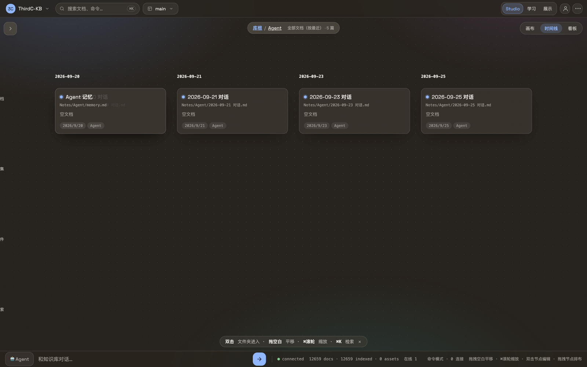
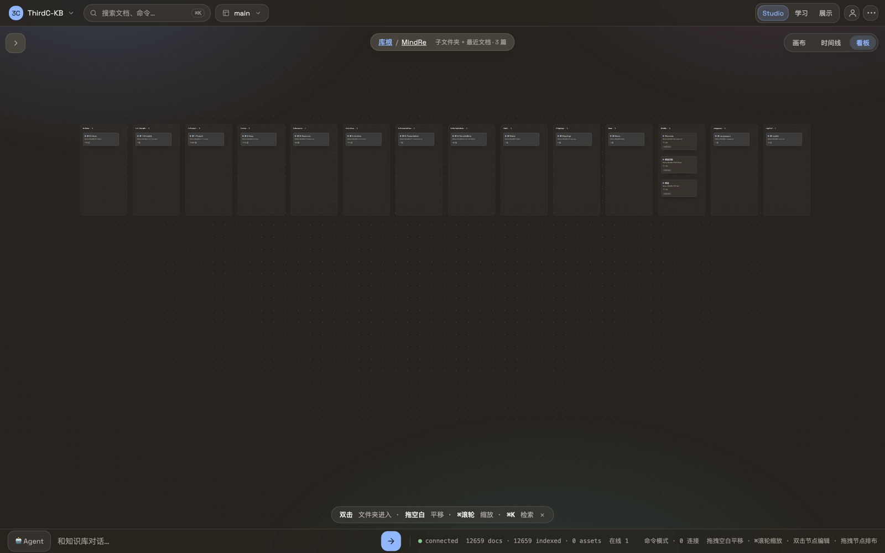

**是什么**：同一份数据的三种排布——画布（自由空间）、时间线（按修改日期分列，顶部标日期）、看板（按集合分栏，**拖卡片跨栏即移动文件**）。
**怎么用**：右上角视图胶囊点击切换，快捷键 `1`（画布）/ `2`（时间线）/ `3`（看板）。

#### A3 · 多画布管理

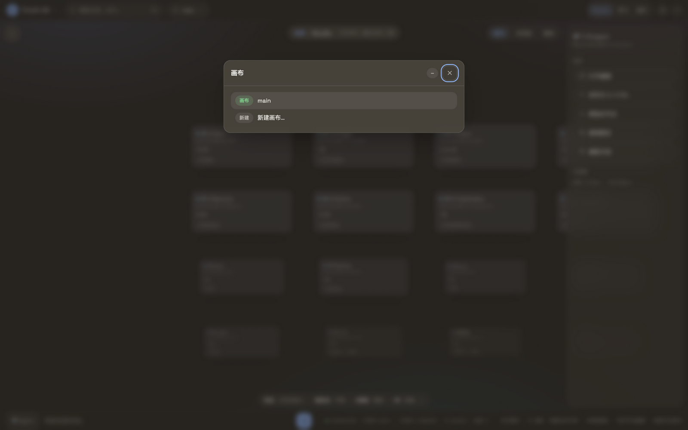

**是什么**：一个库可以有多张画布（如 `main`、`项目看板`），各自独立布局；顶栏胶囊显示当前画布名。
**怎么用**：点顶栏画布胶囊（`main ▾`）→ 面板里**点画布名切换 / 新建画布 / 删除非 main 画布**。

#### A4 · 侧栏：文档树、透镜过滤与工具 Widget 区

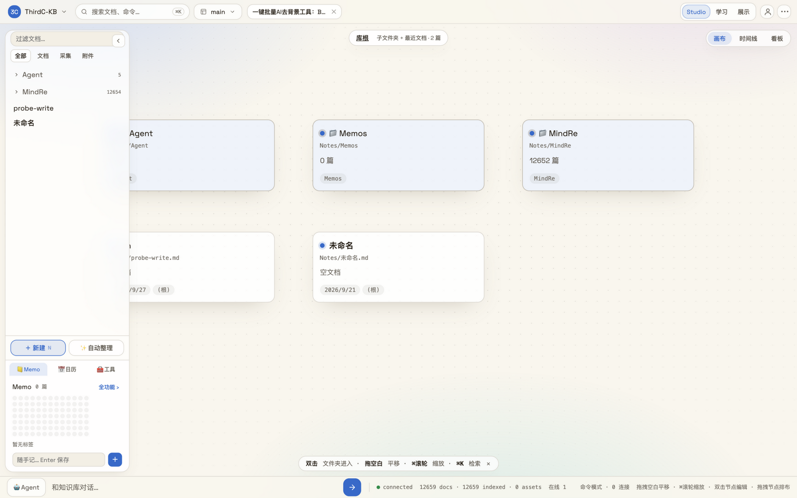

**是什么**：左栏自上而下——「过滤文档」即时搜索、透镜（全部 / 文档 / 采集 / 附件）、文档树；底部是**三标签 Widget 区**：📒 Memo（热力图 + 标签 + 随手记）、📅 日历（迷你月历，当日改动打点，⤢ 进整月视图）、🧰 工具（采集主题 / 网页本地化 / 连接器 / 发布 / 设计规范 / 日历 / 回收站 / 路线图八个快捷入口）。宽屏默认展开，窄屏默认收起。
**怎么用**：输入关键词过滤文档树 → 点条目在画布上定位；新建与自动整理在底栏 `✦ Magic` 弧形菜单；Widget 区点标签即切，工具格一点直达对应面板。

#### A4+ · 新建文档：知道会存到哪

**是什么**：新建弹窗直接告诉你目标目录（跟随当前画布所在文件夹），标题支持 `子目录/标题` 语法一步存进子文件夹；创建后自动打开、进入编辑态，toast 与抽屉路径栏都会显示完整路径。
**怎么用**：`N` 或底栏 `✦ Magic` → `＋ 新建` → 输入 `研究/收集箱` 这样的标题 → 确认。

#### A5 · 检查器：选中节点的动作面板

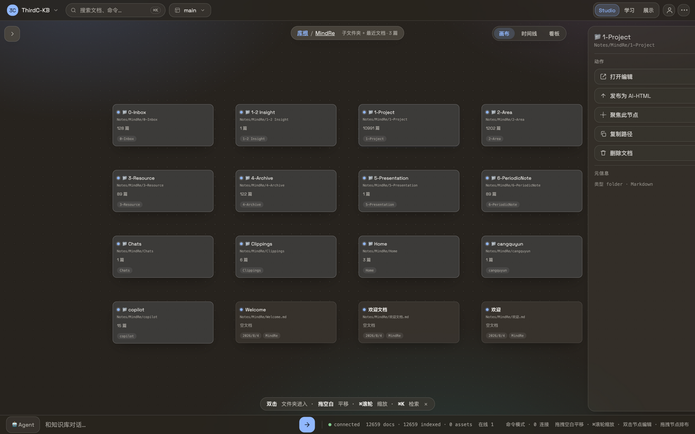

**是什么**：点选任意节点，右侧滑出检查器——标题、路径、动作五件套（打开编辑 / 发布为 AI-HTML / 聚焦此节点 / 复制路径 / 删除文档）与元信息（类型 · 格式）。
**怎么用**：单击节点 → 右侧面板点动作；`Esc` 或点空白收回。

#### A6 · 整理工具态：圈选批量操作

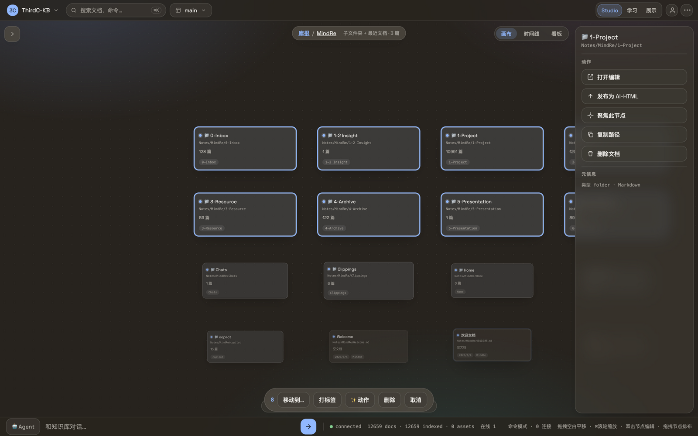

**是什么**：Studio 的工具态（非独立模式）：空白处拖拽画套索，圈中的节点高亮，底部浮出批量栏——`移动到…` `打标签` `✨ 动作` `删除` `取消`。
**怎么用**：`⋯` 菜单 → `✨ 整理（圈选批量）`（快捷键 `M`）→ 拖拽圈选 → 点批量动作；`M` 或 `Esc` 返回创作态。

#### A7 · 编辑抽屉：文件真相阅读视图

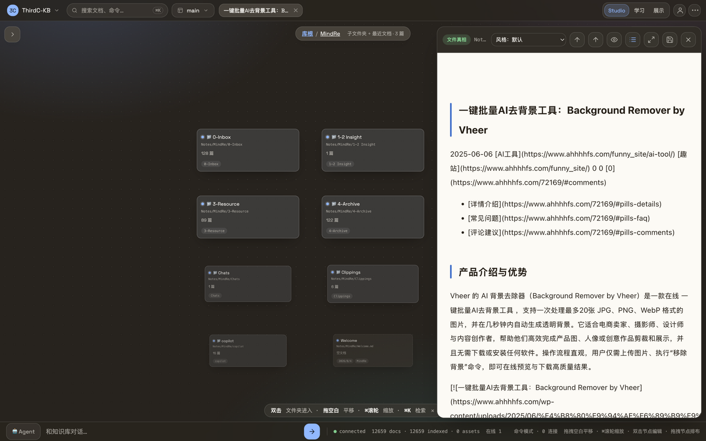

**是什么**：打开文档即右侧抽屉：徽章「文件真相」+ 完整路径时刻提醒你编辑的就是磁盘文件；正文渲染为语义化 AI-HTML，右上角可即时换阅读风格。
**怎么用**：双击文档节点 / 侧栏点条目 → 抽屉滑出；`Esc` 关闭。

#### A8 · 铺开编辑：左源码 + 右实时预览

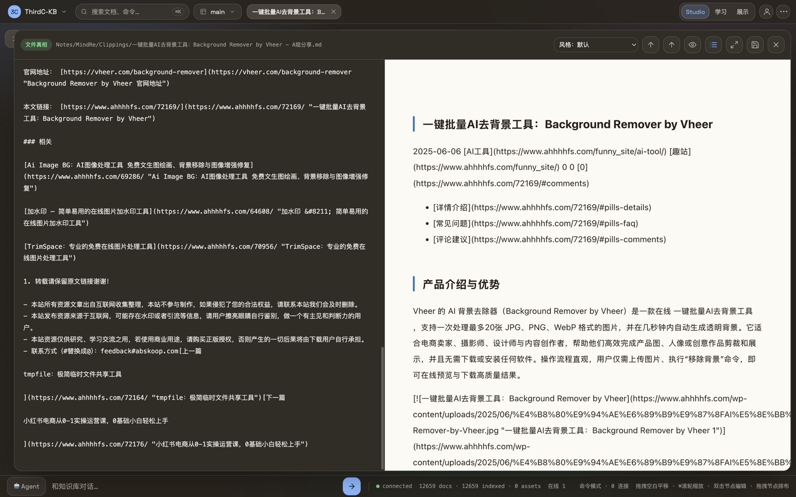

**是什么**：一键把抽屉铺满画布区——左侧 Markdown 源码、右侧实时预览，打字即防抖保存并刷新预览（光标离开也会自动保存）。
**怎么用**：抽屉工具栏点「铺开」按钮（⤢）；`⌘S` 手动保存；徽章旁可上传附件（图片 / PDF / DOCX，自动解析入库）。

#### A8+ · 快捷格式工具栏

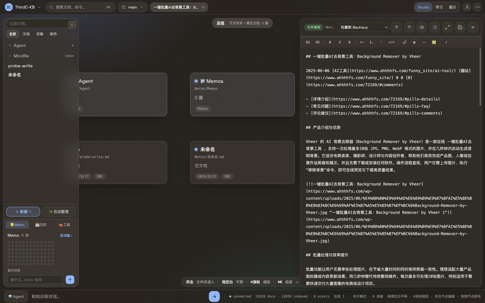

**是什么**：编辑态（含铺开）自动出现在抽屉上方的 Markdown 工具栏——`H1` `H2` `加粗` `斜体` `删除线` `无序/有序列表` `引用` `行内代码` `链接` `表格` `分隔线` `图片上传`，末尾的 `/` 直达完整插入菜单；预览态与 text/html 格式文档自动隐藏。
**怎么用**：编辑模式选中文字点按钮即包裹，未选中则插入占位符；行级按钮（标题 / 列表 / 引用）作用于当前行并自动清除旧前缀。

#### A9 · Notion 式 `/` 插入菜单

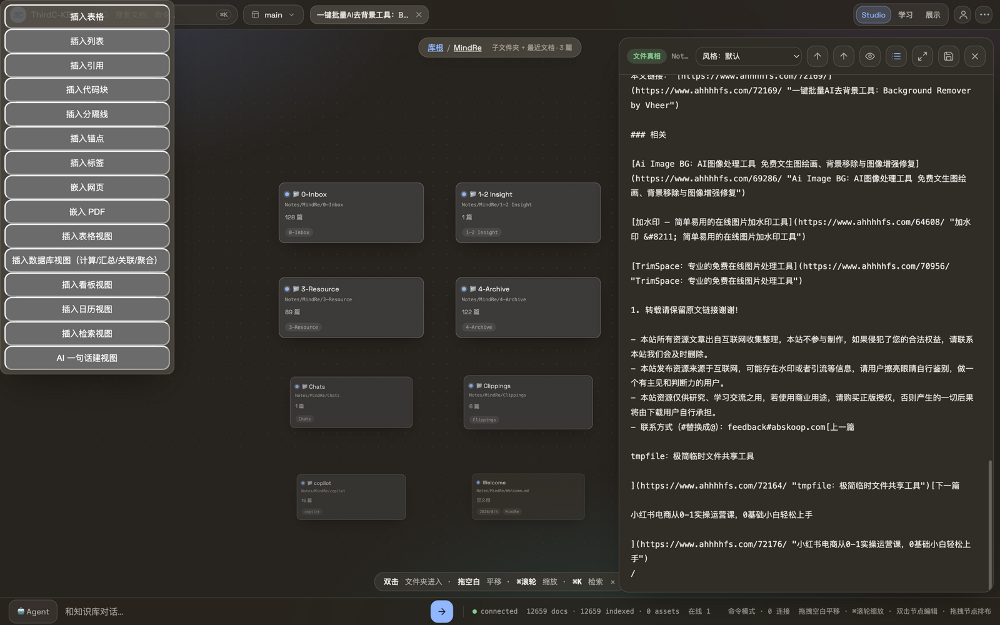

**是什么**：编辑器内输入 `/` 唤出插入菜单：表格 / 列表 / 引用 / 代码块 / 分隔线 / 锚点 / 标签 / 嵌入网页 / 嵌入 PDF，以及四种**数据库视图**（表格视图 / 看板视图 / 日历视图 / 检索视图 / 数据库视图：计算汇总关联聚合）与「AI 一句话建视图」。
**怎么用**：编辑模式光标处输入 `/` → `↑↓` 选择 → `Enter` 插入；`Esc` 取消。

#### A10 · 划选即指令（动作栏）

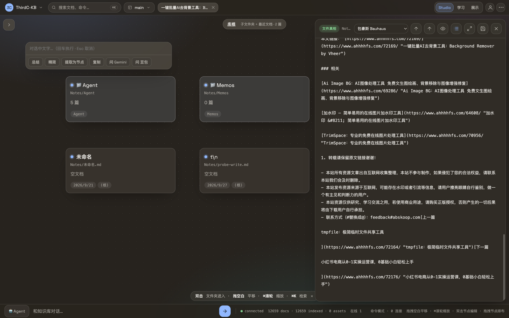

**是什么**：在编辑器里划选文字（或选中 / 多选画布节点）自动浮出动作栏——规则动词离线可用：`总结` `精简` `提取为节点` `复制`，以及一键外问 `问 Gemini` / `问 豆包`（复制选文并打开对应站点，粘贴即问；右键原生菜单的复制 / 搜索不受影响）；节点态还有 `连到…` `打标签`，多选态 `合并` `生成结构`；配置 AI 后追加 `改写` `扩写` `翻译`（标 ✦）。
**怎么用**：划选文字 → 点动词 → 预览结果 → `接受` 写回 / `重试` / `取消`；「提取为节点」直接把选区变成画布新卡片；「复制 / 问 Gemini / 问 豆包」在浏览器本地完成，不需要 AI 配置。

#### A11 · 50 款设计史经典风格

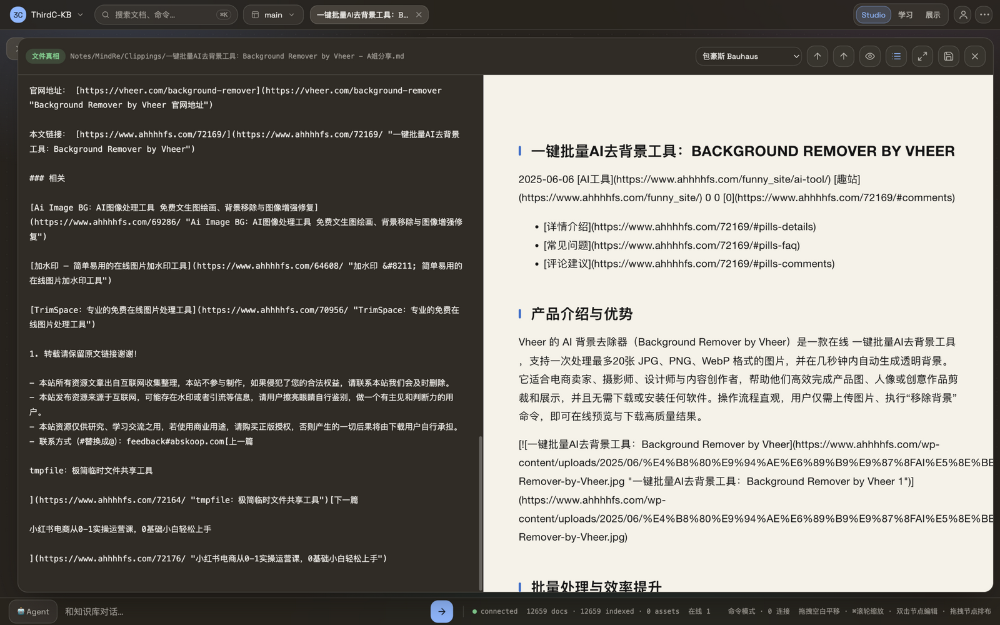

**是什么**：包豪斯 / 瑞士 / 孟菲斯 / 蒸汽波 / 赛博朋克 / 水墨 / 浮世绘 / 侘寂 / 蓝图 / Material…共 50 款完整设计体系，作用于阅读、展示两种视图，抽屉与展示各带风格下拉。
**怎么用**：抽屉右上「风格：默认」下拉即选即换；也可以在 `⋯` → `🎨 设计规范` 里导入自己的 design.md / tokens.css（见 E6）。

---

### 附录 B · Feynman 学习-展示

学习-展示一体：读的时候是沉浸研读，讲的时候直接上台——不制造"AI 生成的假 PPT"，你的文档本身就是幻灯片。

#### B1 · 学习模式：沉浸阅读 + 目录大纲

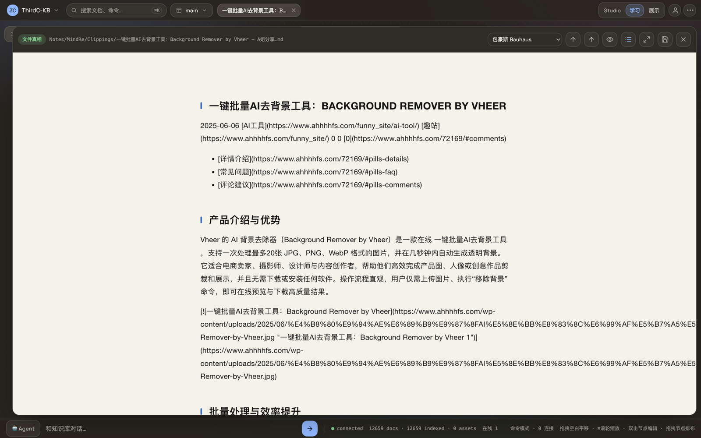
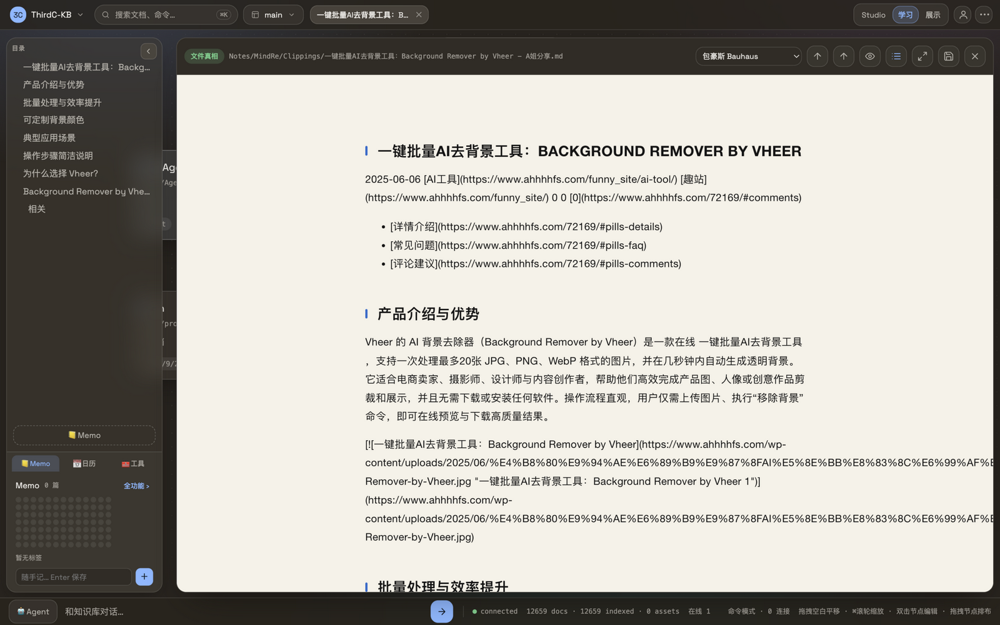

**是什么**：隐藏一切编辑界面，正文铺满全宽（同样支持 50 风格换肤）；左栏切换为「目录大纲」（h2–h4 自动生成，点击跳转、滚动高亮）+ Memo 入口。
**怎么用**：底栏 `✦ Magic` → `学习`（需先打开一篇文档）→ 滚动阅读，左栏点标题跳转；`Esc` 回 Studio。

#### B2 · 展示模式：文档即幻灯片


**是什么**：全屏演示当前画布的文档序列——左侧「大纲」缩略图（Gamma 式，点击跳页），底部控制条（大纲开关 · 标题 · 页码 · 风格选择 · ←/→ 翻页 · **整库 PPT** · 退出）；鼠标静止 2 秒控制条自动退场，一动即回。
**怎么用**：底栏 `✦ Magic` → `展示` → `←` `→` 翻页（同键位支持键盘）→ 风格下拉即时换装 → `整库 PPT` 把当前画布全部文档生成一套可分享的幻灯页 → `Esc` 退出。

---

### 附录 C · Memo 随手记

面向"临时记一笔"的本能需求：不建文档、不选位置，记完就走。

#### C1 · Memo 侧栏速记

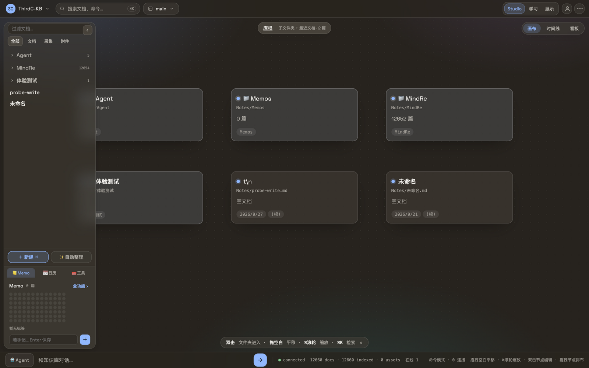

**是什么**：侧栏 Widget 区的 Memo 标签（Studio 与学习模式共用，常驻可见）——今日热力格、标签速览（工作 2 · 灵感 2 · 读书 1…）、底部随手记输入框，右上「全功能 ›」直达完整面板。
**怎么用**：侧栏底部点 `📒 Memo` 标签 → 输入框打字 `Enter` 保存（自动写入 `Notes/Memos/日期.md`，带时间戳与 `#标签`）；点热力格进全功能。

#### C2 · 全功能 Memo：热力图 + 标签快查 + 语音

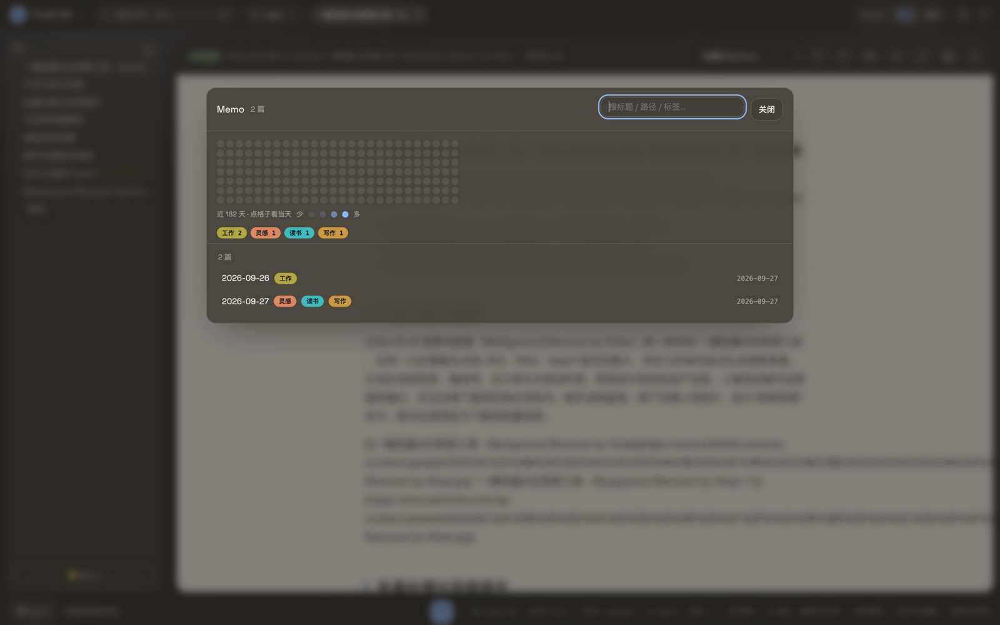

**是什么**：完整 Memo 面板——近 182 天写作热力图（颜色越深写得越多，点格子看当天）、标签筛选链、按日期分组的 memo 列表；搜索框支持标题 / 路径 / 标签。
**怎么用**：`⌘⇧M` 或侧栏「全功能 ›」打开 → 点热力格跳当天 → 点标签只看该类 → 列表点条目打开原文；移动端 Memo 面板支持**语音速记**（按住录音，中文语音实时转文字）。

#### C3 · 内容日历（侧栏迷你月历 + 整月视图）

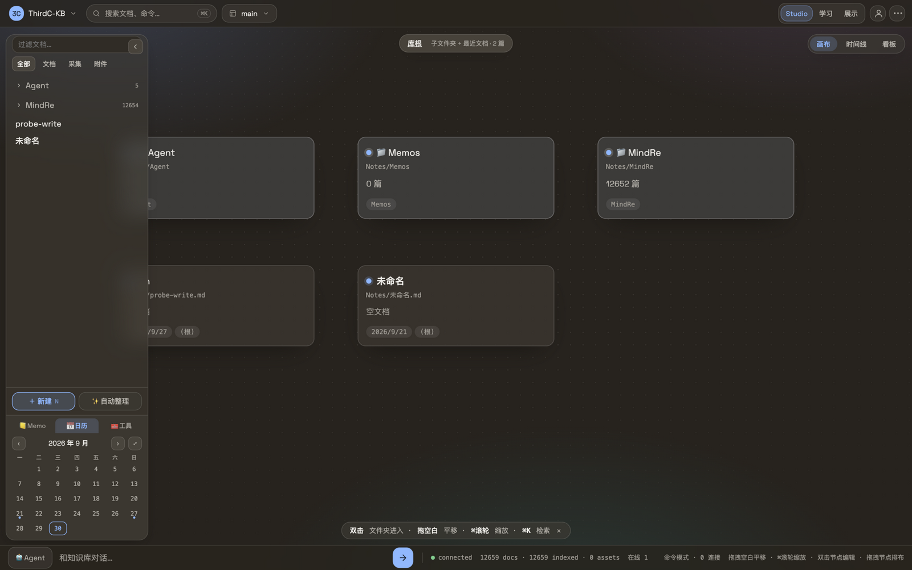
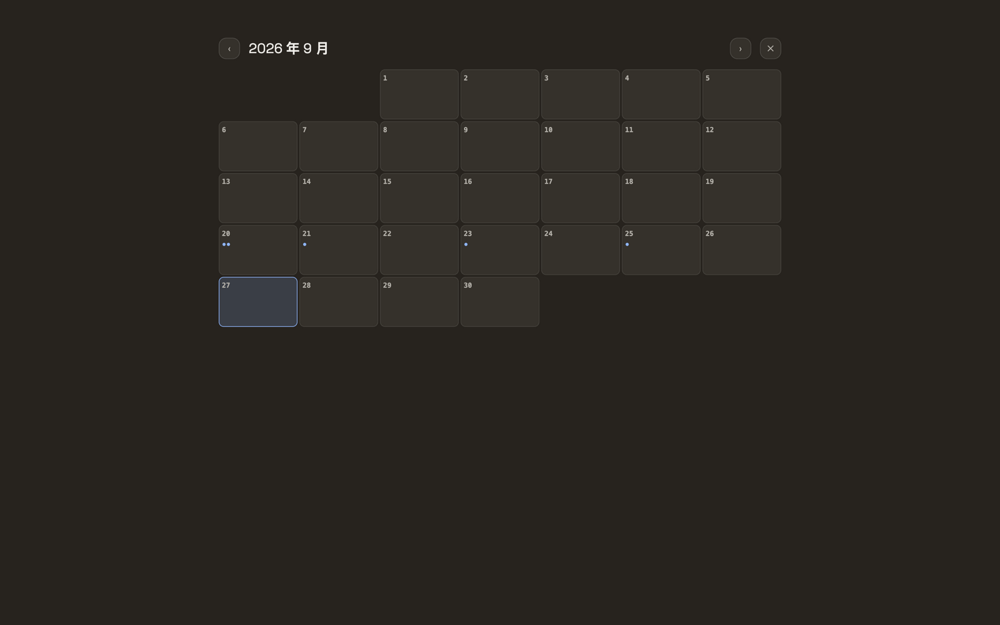

**是什么**：侧栏 Widget 区的「📅 日历」标签是一张迷你月历——每天格子里的小圆点 = 当天有改动的文档，今天高亮边框；右上 `⤢` 展开整月大图。以月历视角看"哪天写了什么"。
**怎么用**：侧栏点 `📅 日历` → `‹` `›` 翻月 → 点有圆点的日期，一篇直接打开、多篇弹序号选择；`⤢` 或 `⌘K` 命令 `cal` 进整月视图。

---

### 附录 D · Agent-L：面向 AI 的 SAG 知识库

知识库不只给人看：同一套本地 API 对 agent 开放，工具调用全程可见、可审计。

#### D1 · 对话优先的 Agent 模式

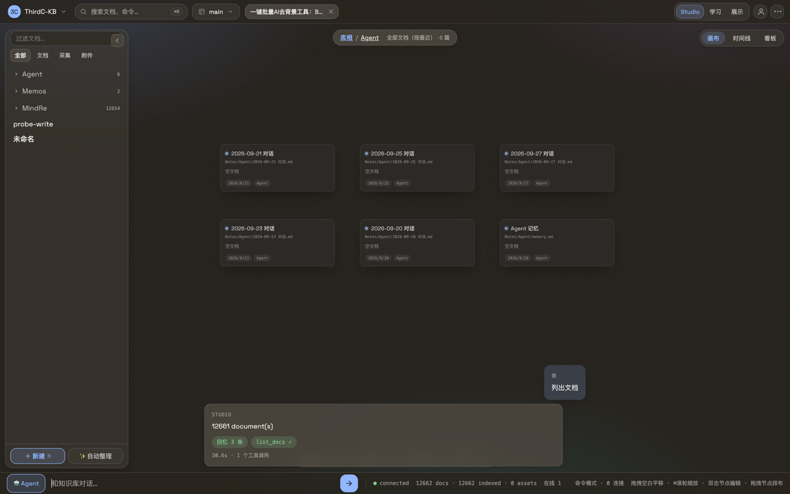

**是什么**：底栏对话输入即 Agent 入口——回复流式打字机上屏，**每一步工具调用都是可见的芯片**（`回忆 3 条` `list_docs ✓`），完成后显示耗时与工具调用数；无 API key 时自动运行在**命令模式**（离线规则引擎，一样能干活）。
**怎么用**：底栏输入「列出文档」「搜索 CRDT」「状态」或自然语言 → `Enter` 发送；点 `🤖 Agent` 切换对话优先布局（画布压暗）；回复中出现的 `Notes/...` 路径自动渲染为可点击来源。

#### D2 · A2UI：agent 推来的原生交互组件

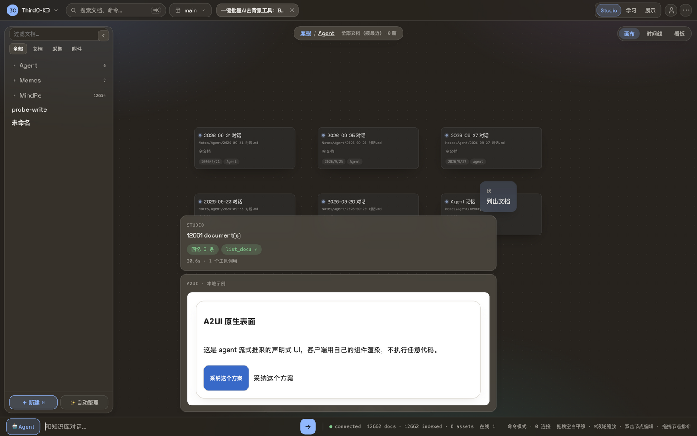

**是什么**：agent 可以在对话里推流**声明式 UI**（A2UI）——按钮、表单、卡片由客户端原生组件渲染，不执行任意代码；点击动作回传 agent 继续编排。
**怎么用**：`⌘K` → `A2UI 示例`（命令 `a`）体验；agent 回复中带 `data-action` 的组件点击即触发对应工具。

#### D3 · Agent 记忆：跨会话的偏好与事实

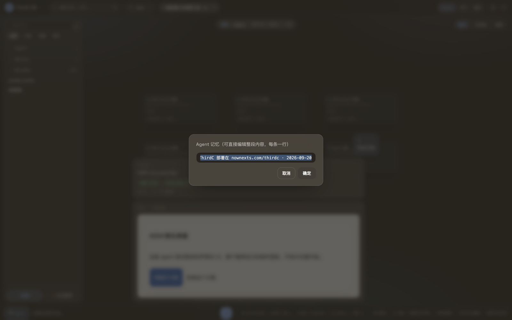

**是什么**：agent 的长期记忆落在 `Notes/Agent/memory.md`（普通文件！）——对话前自动召回相关记忆（对话里可见 `回忆 N 条` 芯片），支持整段编辑与单条追加。
**怎么用**：`⌘K` → `Agent 记忆`（`mem`）整段查看编辑；`记住一件事`（`rm`）追加一条（类型：偏好 / 事实 / 决策）；`回忆（检索历史）`（`rc`）语义检索过往记忆。

#### D4 · ⌘K 检索与命令面板

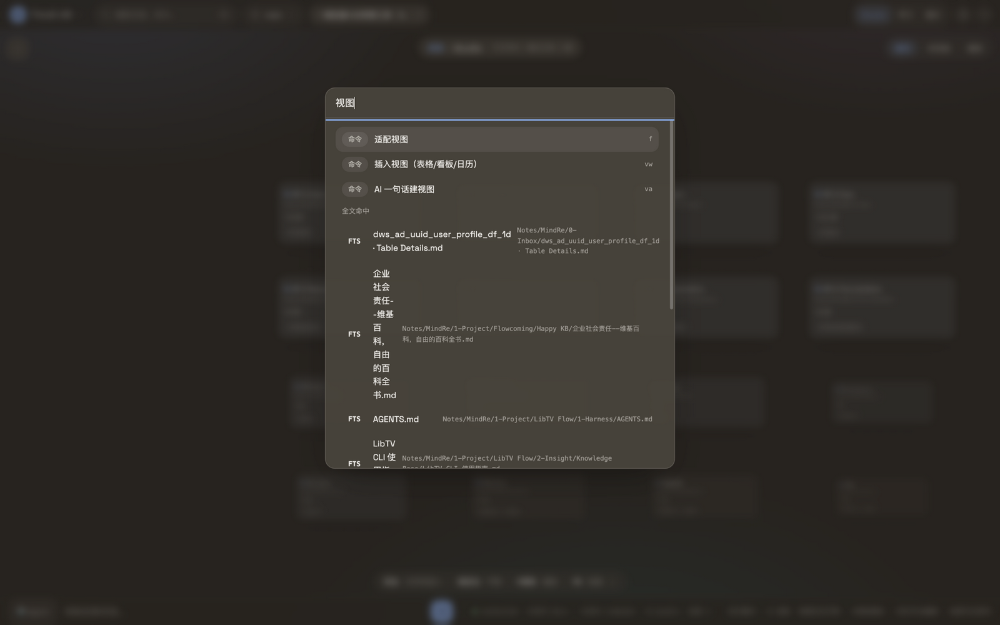

**是什么**：检索与命令的唯一入口——文档模糊搜索（标题 + 路径）+ FTS5 全文命中（内容里有的也补上）+ 27 个命令（新建 / 发布 / 整理 / 同步 / 主题 / 路线…）同框混排。
**怎么用**：`⌘K`（或底栏输入框切到 `🔍` 搜索模式直接输入）→ 直接打字 → `↑↓` 选择 → `Enter`；命令有快捷键别名（如 `n` 新建、`p` 发布）。

#### D5 · MCP 连接器

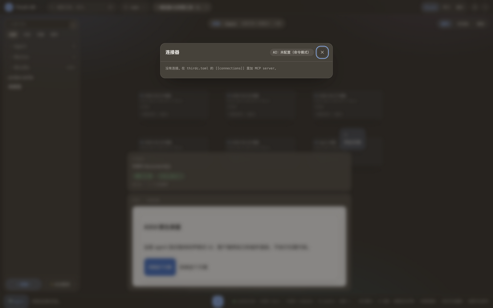

**是什么**：外部 MCP server 的管理面板——每个连接可**探测**（列出 tools / resources）与**采集**（把资源拉入库）；面板徽章显示 AI 配置状态。
**怎么用**：`thirdc.toml` 里加 `[[connections]]`（name + command + args）→ `⌘K` → `连接器管理`（`c`）→ 逐个探测 / 采集。反向：`thirdc mcp` 把 ThirdC 自己作为 MCP server 给别的 agent 用。

---

### 附录 E · Studio 工作室：发布与生态分发

更重、更面向商业场景的一面：把知识库变成对内对外的分发站。

#### E1 · 发布：AI-HTML 静态站 + llms.txt

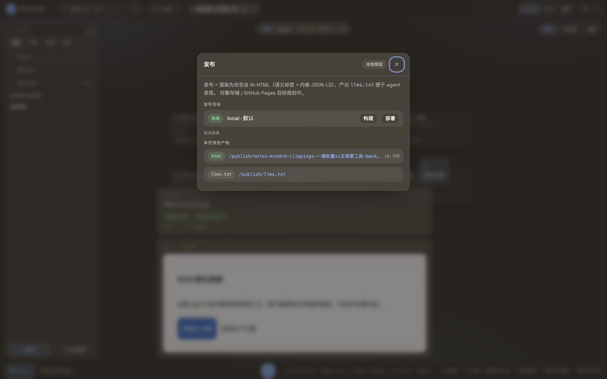

**是什么**：文档 / 整库渲染为**自包含 AI-HTML**（语义标签 + 内嵌 JSON-LD，agent 可直接抽取结构化数据），产物列表实时可见，并自动生成 `llms.txt` 供 agent 发现。
**怎么用**：选中节点 → 检查器「发布为 AI-HTML」，或 `⋯` → `⬆ 发布 / 线上`（`⌘K` 命令 `p`）→ 发布目标里 `构建` / `部署`（本地默认；Git（Pages）/ S3 兼容（R2·OSS·COS）/ Cloudflare Pages 目标见配置）。

#### E2 · 加密分享：服务器看不到内容

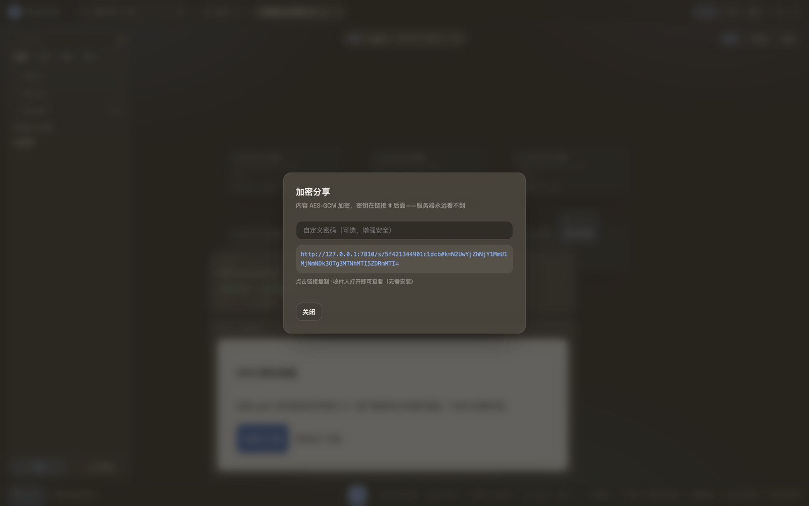

**是什么**：一键生成分享链接——内容 AES-GCM 加密，**密钥放在链接 `#` 后面**（浏览器片段，永不上传），服务器只存密文；可选自定义密码二次加固。收件人打开即读，无需安装。
**怎么用**：打开一篇文档 → `⌘K` → `分享当前文档（加密）`（`sh`）→ （可选填密码）→ 点链接复制发给对方。

#### E3 · 设置：账号与远程同步

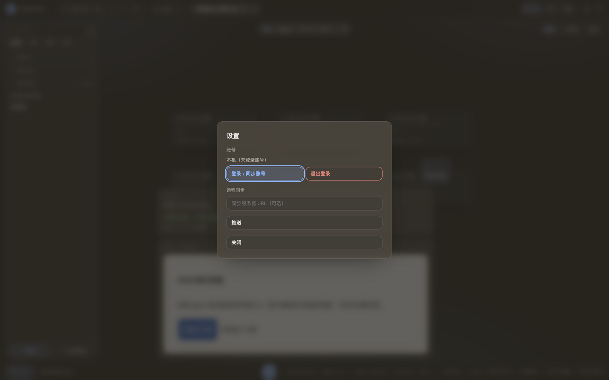

**是什么**：账号区（登录 / 同步账号、退出）、远程同步区（填同步服务器 URL → 推送）。桌面端此面板额外提供本机能力：导入本机目录（md/txt/html 复制入库）、内嵌终端（白名单命令）、扫描无用文档并隔离。
**怎么用**：`⋯` → `⚙ 设置`。

#### E4 · 账号面板：API Token 与插件接入

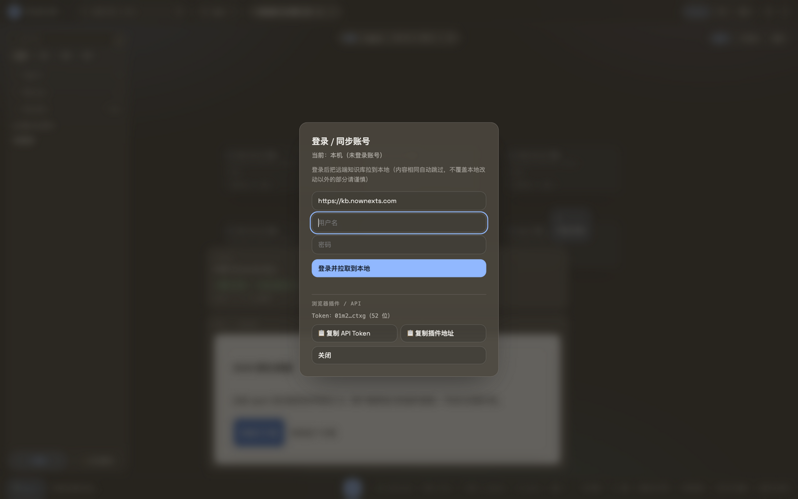

**是什么**：登录 / 同步账号（登录后把远端知识库拉到本地）；下半区是给**浏览器插件 / 第三方 API** 用的凭证中心——打码显示 Token，一键复制 Token 与插件地址。
**怎么用**：顶栏右上角人像按钮 → 复制 API Token / 插件地址 → 粘贴进浏览器扩展设置即可离线直采（桌面端固定监听 `127.0.0.1:7717`）。

#### E5 · 回收站：可恢复的删除

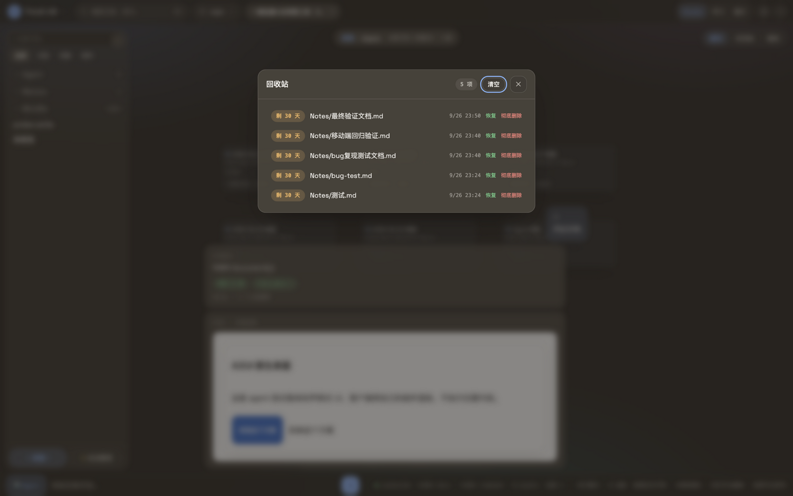

**是什么**：删除的文档 / 文件夹先进回收站，保留期默认 30 天（`trash_days` 可配），逐条显示剩余天数与删除时间，支持单条恢复 / 彻底删除 / 一键清空。
**怎么用**：`⋯` → `🗑 回收站`（`⌘K` 命令 `x`）→ 点 `恢复` 或 `彻底删除`；`清空`需二次确认。

#### E6 · 设计规范：让 AI 按你的规范渲染

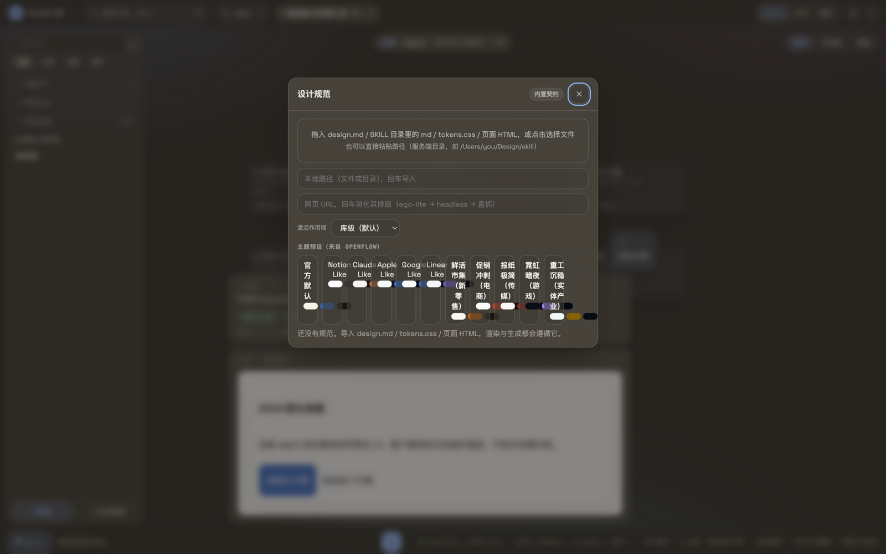

**是什么**：把设计契约喂给渲染与生成管线——拖入 / 粘贴路径 / 网页 URL 三种方式导入 design.md / tokens.css / 页面 HTML（URL 走 ego-lite → headless → 直抓三档消化），激活作用域可选**库级 / 发布级 / 当前文档**；下方是来自 OpenFlow 的主题预设色板（Notion Like / Claude Like / 鲜活市集 / 促销冲刺 / 霓虹暗夜…）。
**怎么用**：`⋯` → `🎨 设计规范`（`⌘K` 命令 `g`）→ 选导入方式 → 选作用域 → 之后阅读渲染与 AI 生成都会遵循它。

---

### 附录 F · 采集与积累（双向 AI · 输入侧）

#### F1 · 引导卡：打开就能建库

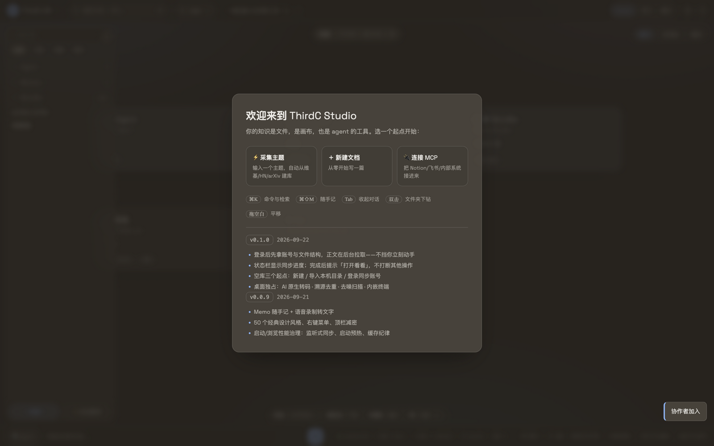

**是什么**：新库首屏三选一——`⚡ 采集主题`（输入主题自动从维基 / HN / arXiv 建库）、`＋ 新建文档`、`🔌 连接 MCP`（把 Notion / 飞书 / 内部系统接进来）；下方常驻快捷键提示与版本更新日志。
**怎么用**：点任一卡片即起步；关掉后随时 `⌘K` → `采集主题（快速建库）` 重来。

#### F2 · 其余采集入口（文字速览）

| 入口 | 位置 | 用法 |
|---|---|---|
| 网页本地化 | `⌘K` → 命令 `w` | 输入 URL → 抓取正文转 Markdown 入库（网页剪藏语义） |
| 主题一键建库 | `⌘K` → `采集主题（快速建库）` | 输入主题 + 篇数 → Wikipedia / HN / arXiv 批量采集 |
| 附件解析 | 编辑抽屉「上传」按钮 | **HTML 原样入库**（一等文档，原文保留可预览）；**代码/数据文本原样保留扩展名**（py / js / ts / json / yaml / toml / css / sh / csv…字节级往返，可编辑、带语法高亮预览）；**PDF / DOCX / XLSX / PPTX 自动转码**为可检索的 Markdown 代理（表格 / 幻灯大纲）+ 原件存 Assets；图片入库为附件并插引用 |
| Obsidian 导入 | 设置面板（桌面端） | 选目录复制入库：md 原样、**HTML 保留一等文档并把目录内相对引用（css / js / 图片）内联为自包含单文件**、代码文件保留扩展名、其余提取文本转 Markdown，SHA256 去重 + 来源 frontmatter |
| 浏览器扩展 | `extension/`（Chrome）/ `extension-firefox/` | 整页 / 选区采集；桌面端运行时经 `127.0.0.1:7717` + Token 离线直采 |
| MCP 拉取 | 连接器面板（见 D5） | 外部系统资源批量入库 |

> **文件真相的扩展名即契约**：`.md` 走块模型规范化；`.html` 是一等文档（原文保留、浏览器可预览）；代码/结构化文本（verbatim）字节级往返；二进制原件进 `Assets/` + 自动生成可检索的 Markdown 代理。人和 agent 走同一条 `/doc` `/asset` 路径读写。

---

### 附录 G · 全局底座

#### G1 · 更多菜单（工具总入口）

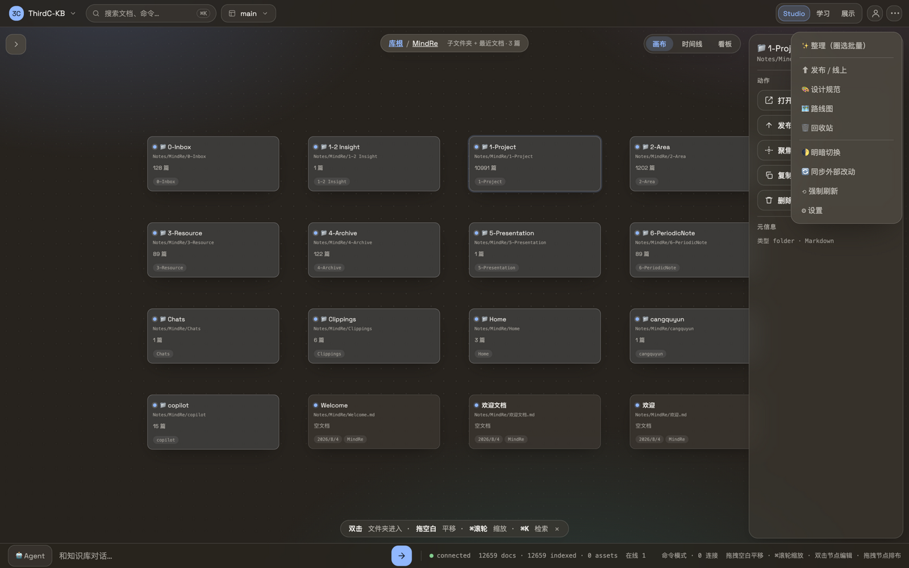

**是什么**：顶栏 `⋯` 展开：整理（圈选批量）· 展示模式 · 发布 / 线上 · 设计规范 · 路线图 · 回收站 · 明暗切换 · 同步外部改动 · 强制刷新 · 设置。
**怎么用**：点 `⋯` 即弹；`同步外部改动`手动触发一次全量扫描合并（平时文件监听自动同步）。

#### G2 · 路线图：功能可见性契约

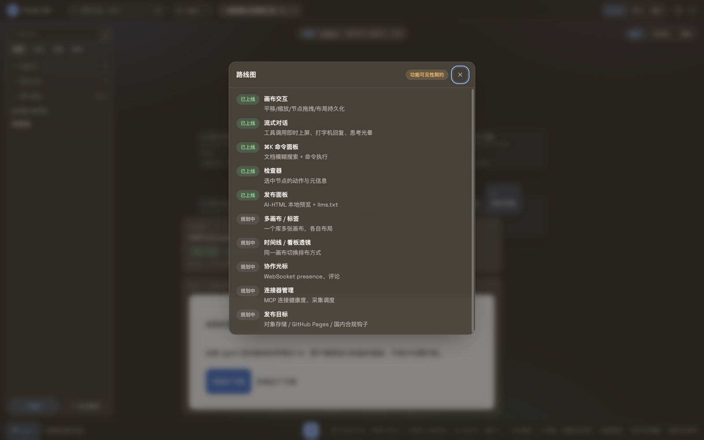

**是什么**：面板里公示已上线 / 规划中的功能清单——「功能可见性契约」：界面上承诺的都能找到，没上的不装先上线。
**怎么用**：`⋯` → `🗺 路线图`（`⌘K` 命令 `r`）。

#### G3 · 明暗主题


**是什么**：全 token 化的亮 / 暗双主题，跟随系统亦可手动切换；切换即时生效无刷新。
**怎么用**：`⋯` → `🌓 明暗切换`（`⌘K` 命令 `d`）。

---

### 快捷键速查

| 键 | 作用 |
|---|---|
| `⌘K` | 检索与命令面板（唯一入口） |
| `N` | 新建文档 |
| `M` | 整理工具态（圈选批量），再按返回 |
| `1` / `2` / `3` | 画布 / 时间线 / 看板 |
| `⌘⇧M` | Memo 随手记 |
| `⌘.` | 划选即指令（对选区 / 选中节点） |
| `⌘S` | 保存文档 |
| `Esc` | 关闭浮层 / 退出学习 / 展示 / 整理 |
| `←` `→` | 展示模式翻页 |
| `双击节点` | 文件夹下钻 / 文档打开 |
| `拖空白` | 平移画布 |
| `⌘+滚轮` | 缩放画布 |
| `Tab` | 收起对话 |

---

## License

AGPL-3.0 — 商用与私有部署欢迎,二次开发请遵守同源许可。

<div align="center">
<sub>芭乐派产品矩阵 · Studio 套件成员 · 与 <a href="https://github.com/sevenaaaaaaaaa/openflow">OpenFlow</a> 同源的设计契约</sub>
</div>
