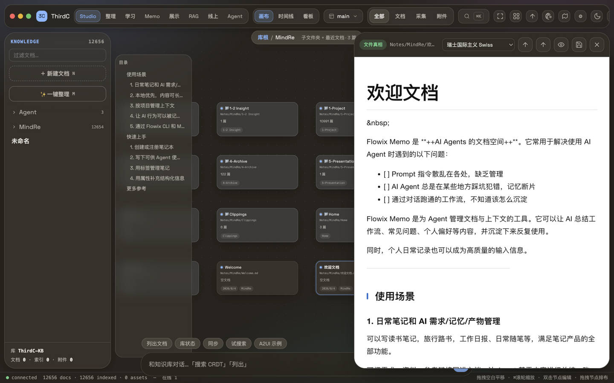
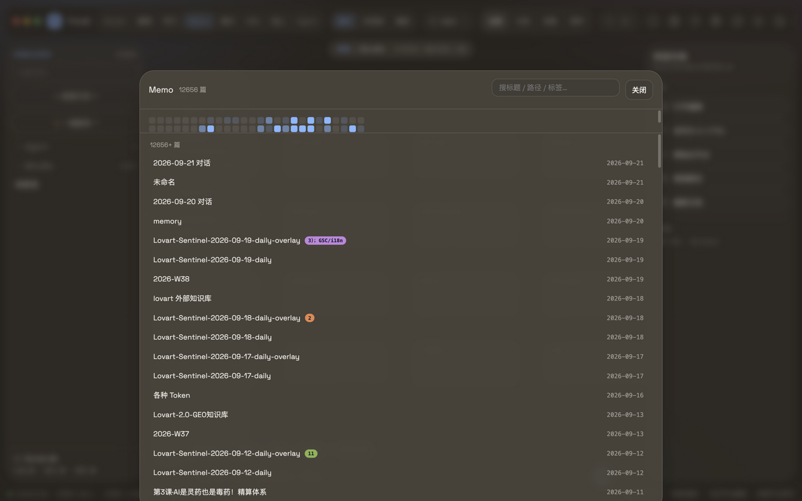

<div align="center">

# ThirdC Studio

**AI Native 知识工作台 — 文件即真相,画布即界面,agent 即同事。**

你的知识库是磁盘上一堆普通 Markdown:人用画布和阅读器看它,agent 用同一套本地 API 读写它。Rust 单二进制,本地优先,无锁定。

[](https://github.com/sevenaaaaaaaaa/thirdc/releases)
[](#license)
[](#快速上手)
[](https://www.rust-lang.org)
[](docs/spec/PRODUCT.md)

[下载桌面客户端](https://github.com/sevenaaaaaaaaa/thirdc/releases) · [快速上手](#快速上手) · [核心能力](#核心能力) · [定位说明](#定位说明) · [使用指南](#使用指南) · [设计规范](docs/spec/PRODUCT.md)


*画布空间 · 阅读抽屉(50 款设计史经典风格实时换肤)· 七模式一键切换*

</div>

---

## 这是什么

笔记软件把知识锁进私有格式,agent 框架把知识锁进向量库。ThirdC 反过来:**知识库就是磁盘上一堆普通的 Markdown / HTML 文件**,任何编辑器都能打开,随时可以带走。sidecar(索引、日志)删了就重建,真相永远在 `Notes/` 和 `Assets/` 里。

人和 agent 共享同一个真相:你用画布、阅读器、热力图来看和写;agent 通过同一套本地 API 与 MCP 双向读写,写完即索引。谁也不锁定谁——这就是「文件即真相、画布即界面、agent 即同事」。

它是一个 Rust 写的本地程序:桌面客户端把内核内嵌在 Tauri 壳里,也可以用一条命令把内核跑成 Web 服务(`thirdc serve`),浏览器直接访问。没有账号,没有云,数据在你自己的磁盘上。

## 核心能力

- **文件真相** — `Notes/` 下真 Markdown / HTML + CRDT op-log 合并;索引与日志随时删除重建,不锁定任何格式
- **七模式** — Studio 画布(节点拖排/景深/连线/多画布)· 整理 · 学习 · **Memo**(写作热力图 + 标签快查 + 语音速记)· 展示(文档即幻灯片)· RAG 检索 · 线上发布 · Agent 对话,一键切换
- **50 款设计风格** — 包豪斯 / 瑞士 / 孟菲斯 / 蒸汽波 / 水墨 / 浮世绘……学习与展示视图一键换肤,源自代码内置的 50 个风格档案
- **AI 双向** — MCP server + 流式对话 + 命令模式(无 API key 离线可用);对话实时显示工具调用与 token 计量
- **采集** — 主题一键建库(Wikipedia / HN / arXiv)· 网页本地化 · PDF/DOCX 解析 · Obsidian 导入 · 浏览器扩展
- **发布** — AI-HTML 静态站(语义标签 + JSON-LD + llms.txt)→ 本地 / Git / S3(R2·OSS·COS)/ WebDAV;E2EE 加密分享
- **合规** — ICP 注入 · 敏感词 · 机审 API · 审计留痕,团队与对外发布场景可用
- **快,且有契约** — 1.2 万篇文档库:热路径文档打开 1ms、全文检索 23ms(FTS5 + TF-IDF);8 条端点延迟预算写进[性能契约](docs/PERF.md),超支即红,不许合

<p>
  
  
</p>

*左:Memo 模式(近 180 天写作热力图,点格子看当天)。右:对话优先的 Agent 模式。*

## 快速上手

### 桌面客户端(推荐)

从 [Releases](https://github.com/sevenaaaaaaaaa/thirdc/releases) 下载 `ThirdC Studio_x.x.x_aarch64.dmg`(Apple Silicon,macOS 12+)。
未做公证,首次打开:**右键 → 打开**,或 `xattr -cr "/Applications/ThirdC Studio.app"`。

默认库 `~/Documents/ThirdC`,首次启动自动创建;应用内库选择器可切换,`THIRDC_VAULT` 环境变量亦可。

### CLI + Web

```bash
cargo build --release -p thirdc
./target/release/thirdc init ./kb MyKnowledge
./target/release/thirdc serve ./kb --addr 127.0.0.1:7700
```

打开 `http://127.0.0.1:7700` → 登录(`admin` / token,见 `kb/.thirdc/machine.toml`;可在 `thirdc.toml` 的 `[auth]` 自定义)。

### 服务端部署

```bash
./deploy/deploy.sh        # rsync → 服务器端构建 → systemd 托管 + Apache 反代
```

启动预热自动完成索引 / 检索语料 / Memo 索引三步(构建在锁外,部署窗口站点照常服务)。

### 从其它知识库迁移

Obsidian 库直接导入(设置面板 → 导入);PDF / DOCX / 网页 / Wikipedia 主题一键采集。

### 七模式速查

| 模式 | 干什么 | 快捷键 |
|---|---|---|
| **Studio** | 画布空间:节点拖排、景深、连线、多画布 | `3` |
| **整理** | 圈选批量:移动 / 打标签 / 删除 | — |
| **学习** | 沉浸阅读 + 50 风格换肤 | — |
| **Memo** | 写作热力图 · 日期/标签快查 · 语音速记 | — |
| **展示** | 文档即幻灯片(同样支持 50 风格) | — |
| **RAG** | 全库检索:FTS5 + TF-IDF 混合排序 | ⌘K |
| **线上** | 发布为静态站 + 分享 | — |
| **Agent** | 对话优先,工具调用全程可见 | ⌘⇧M |

## 定位说明

ThirdC 属于芭乐派产品矩阵的**第三层:Studio 套件**——偏本地工具的产品层。矩阵的分层是:

- **OpenFlow = 入口层**:TIPS all-in-one,让一人团队(OPC)与中小团队低门槛完成数字化 + AI 化。
- **Flow 家族 = 进阶层**:MFlow / inFlow / UserLoop / PayFlow / LearnFlow / WebsFlow 按需进阶,各自深耕一个业务场景。
- **Studio 套件 = 本地工具层**:ThirdC(知识工作台)、V2HTML(视频⇄内容引擎)、InputFlow(隐私输入法)、ZeroZen(广告净化)等,吸引更多用户,长期方向是**作为工作台打通所有 Flow 产品**。

与 OpenFlow 矩阵是**松耦合**:ThirdC 不依赖 OpenFlow 即可完整使用;共享同一套设计契约(全 oklch · 零 hex · 弹簧缓动 · 玻璃拟态 · 圆角三档),未来通过 MCP / 本地 API 成为矩阵的知识与文档工作台——Flow 产品产生的报告、素材、文档,都可以落进 ThirdC 的文件真相里被人和 agent 共同使用。

## 使用指南

完整使用指南(库结构 / 七模式操作 / 采集与发布 / MCP 接入)见 [docs/USAGE-GUIDE.md](docs/USAGE-GUIDE.md)。
设计规范与架构决策见 [docs/spec/](docs/spec/) 与 [docs/adr/](docs/adr/)。

## 当前边界

- **桌面端目前只有 macOS**(Apple Silicon,未公证),Windows / Linux / Android / iOS 在[多端规划](docs/spec/platform.md)中,未落地
- **桌面独占能力未完成**:全盘索引、AI 原生转码、本地小模型、内嵌终端见[桌面路线](docs/spec/desktop.md),当前桌面壳以内嵌 Web 内核为主
- **发布目标不全**:已支持本地 / Git / S3(R2·OSS·COS)/ WebDAV,GitHub Pages 与对象存储直传仍在路线图
- **性能数字有前提**:1.2 万篇 / 23ms 为实测基线;daemon 冷启动首轮全库同步(约 11s 量级)是预期行为,不在延迟预算内(见 [docs/PERF.md](docs/PERF.md))

## License

AGPL-3.0 — 商用与私有部署欢迎,二次开发请遵守同源许可。

<div align="center">
<sub>芭乐派产品矩阵 · Studio 套件成员 · 与 <a href="https://github.com/sevenaaaaaaaaa/openflow">OpenFlow</a> 同源的设计契约</sub>
</div>
